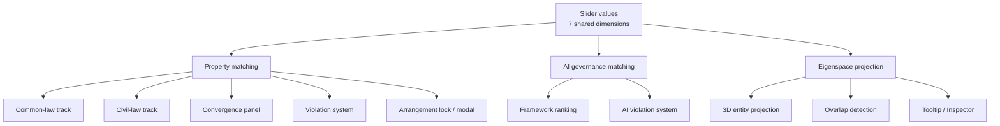

# Architecture

## Purpose

`ccmodel-explorer` is a single-page React + Vite application that maps a shared 7-dimension slider model onto:

1. Property-law classification across two legal traditions.
2. AI governance framework matching.
3. A shared eigenspace projection over all entities.

The application is intentionally organized around one common input space:

- `possession`
- `use`
- `income`
- `alienation`
- `exclusion`
- `duration`
- `inheritability`

Everything else in the system is derived from that shared 7D bundle.

## Tech Stack

- Runtime: React 19, React DOM 19
- Bundler/dev server: Vite 8
- Math: `ml-matrix`
- 3D rendering: `three`
- Styling: plain CSS in [`src/App.css`](../src/App.css) and [`src/index.css`](../src/index.css)
- Tests: Node built-in test runner

Entry point:

- [`src/main.jsx`](../src/main.jsx)

Top-level application shell:

- [`src/App.jsx`](../src/App.jsx)

## High-Level System View



## Runtime Modes

The app has two top-level modes controlled by `mode` state in [`src/App.jsx`](../src/App.jsx):

- `property`
- `ai`

The same slider keys are reused in both modes, but the interpretation changes:

- In `property` mode, the sliders describe legal incidents of a rights bundle.
- In `ai` mode, the same keys are relabeled to governance analogues such as autonomy, capability scope, value capture, access control, and replicability.

This is a core architecture decision: the UI and logic branch by mode, but the underlying state shape does not.

## Top-Level State in `App`

[`src/App.jsx`](../src/App.jsx) is the orchestration layer. It owns all user-visible application state and computes every derived dataset via `useMemo`.

### Source-of-truth state

| State | Purpose |
| --- | --- |
| `locale` | Active UI locale |
| `mode` | `property` or `ai` |
| `sliderValues` | Shared 7D bundle |
| `selectedPreset` | Property-mode selected preset pill |
| `lockedArrangement` | Property-mode locked doctrinal range |
| `activeCommonLawJurisdiction` | Optional `uk` / `us` override |
| `activeCivilJurisdiction` | Optional `de` / `jp` / `tw` / `prc` override |
| `activeAssetType` | PRC-only asset subtype: `land`, `movables`, `intangibles` |
| `violationModalDimension` | Current arrangement-violation modal target |
| `showEigenspace` | Whether the 3D eigenspace panel is mounted |

### Key derived values

| Derived value | Built from | Purpose |
| --- | --- | --- |
| `ui` | `locale` | Localized UI copy |
| `sliderMeta` | `mode`, `locale` | Slider labels and low/high descriptions |
| `sliderBounds` | `mode`, `sliderValues` | Hard bounds for draggable sliders |
| `commonLawMatches` | `sliderValues`, common-law estates, jurisdiction | Ranked common-law matches |
| `civilLawMatches` | `sliderValues`, civil-law estates, jurisdiction, asset type | Ranked civil-law matches |
| `frameworkMatches` | `sliderValues`, AI frameworks | Ranked AI governance matches |
| `violations` | property-mode slider bundle + match context | Property-law warnings/errors/info |
| `aiViolations` | AI-mode slider bundle | AI governance warnings/errors |
| `sliderAnnotations` | civil-law context + localized violations | In-slider doctrinal notes |
| `convergenceResults` | top property matches + harmonization data | Civil/common bridge panel |
| `filteredInstruments` | slider bundle + harmonization instruments | International instrument cards |
| `arrangementViolations` | `sliderValues`, `lockedArrangement` | Out-of-range checks for locked presets |
| `closestAlternative` | arrangement violations + current matches | Snap-to fallback |
| `allEntitiesForPCA` | raw JSON datasets | Shared eigenspace input |

## Render Tree

The main render path in [`src/App.jsx`](../src/App.jsx) is:

1. Hero
2. `SliderPanel`
3. `ViolationAlert`
4. `ArrangementViolationModal`
5. Optional `EigenVisualization`
6. Main content
   - `DualTrackView` in `property` mode
   - `AIFrameworkPanel` in `ai` mode
7. Footer

Important consequence:

- Property and AI mode are not separate pages.
- They are branches of one component tree with shared state conventions.

## Data Layer

### Primary datasets

| File | Role |
| --- | --- |
| [`src/data/commonLawEstates.json`](../src/data/commonLawEstates.json) | Common-law estate definitions |
| [`src/data/civilLawEstates.json`](../src/data/civilLawEstates.json) | Civil-law rights/forms with jurisdiction variants |
| [`src/data/aiFrameworks.json`](../src/data/aiFrameworks.json) | AI governance framework definitions |
| [`src/data/harmonization.json`](../src/data/harmonization.json) | Civil/common convergence metadata |
| [`src/data/harmonizationInstruments.json`](../src/data/harmonizationInstruments.json) | International instrument bridge cards |

### Entity shape

Most computational modules assume entities expose:

- `id`
- `ranges`
- optional `description`
- optional `notes`
- optional `dimensionConstraints`
- optional `dimensionCouplings`
- optional `jurisdictionOverrides`

Mode-specific extras:

- Civil-law entries also carry `names` and `authorities`.
- AI framework entries also carry `authority`, `notes`, and optional `special`.

### Raw vs localized entities

`App` keeps two parallel views of the dataset:

1. Localized arrays for ranking cards and main UI.
2. Raw arrays with `_category` tags for eigenspace math.

This distinction matters:

- Ranking panels use localized data.
- Eigenspace basis construction uses raw numeric data only.
- Eigenspace labels resolve names at render time with `locale`, but underlying PCA input is locale-independent.

## Property-Mode Pipeline

Property mode is a composition of five subsystems.

### 1. Matching

Common-law matching:

- [`src/utils/commonLawResolver.js`](../src/utils/commonLawResolver.js)

Civil-law matching:

- [`src/utils/matchEngine.js`](../src/utils/matchEngine.js)
- [`src/utils/jurisdictionResolver.js`](../src/utils/jurisdictionResolver.js)

Matching algorithm:

1. Resolve the effective range per dimension.
2. Score each dimension with `scoreDimension`.
3. Average the 7 dimension scores.
4. Sort descending by average score.

Important design choices:

- Matching is range-based, not nearest-neighbor Euclidean matching.
- Common-law and civil-law tracks are computed independently.
- Civil-law matching is context-sensitive for jurisdiction and PRC asset type.
- Common-law matching only applies a smaller override layer for specific jurisdiction-sensitive estates.

### 2. Jurisdiction and asset-type overrides

Civil-law range resolution happens in [`src/utils/jurisdictionResolver.js`](../src/utils/jurisdictionResolver.js):

- `resolveEffectiveRanges(estate, jurisdiction, assetType)`
- `getSliderAnnotations(...)`

This module does two things:

1. Rewrites numerical ranges when a jurisdiction/asset context applies.
2. Emits doctrinal annotations for slider UI, especially for PRC-specific caveats.

Common-law override handling is separate and smaller in scope:

- `resolveCommonLawRanges(estate, jurisdiction)`

### 3. Violation system

Property-law violations live in [`src/utils/violationRules.js`](../src/utils/violationRules.js).

They have three roles:

1. Emit `error`, `warning`, and `info` messages.
2. Produce hard slider bounds for some incoherent configurations.
3. Inject special notes into the slider UI.

Architecturally, this is not just validation. It is also a constraint layer that shapes what the user can drag to.

### 4. Arrangement locking and modal analysis

Property mode supports a two-stage preset interaction:

1. First click selects a preset and snaps sliders to its midpoints.
2. Second click locks the arrangement and activates range enforcement/inspection.

The lock-related logic is split between:

- [`src/App.jsx`](../src/App.jsx) for state transitions
- [`src/utils/arrangementViolation.js`](../src/utils/arrangementViolation.js) for out-of-range detection
- [`src/components/ArrangementViolationModal.jsx`](../src/components/ArrangementViolationModal.jsx) for doctrinal drill-down and snap-to alternative

`lockedArrangement` stores:

- the selected estate
- which track it came from
- resolved doctrinal ranges for the current context

This is why arrangement violations are context-sensitive rather than static.

### 5. Convergence and harmonization

Convergence logic lives in [`src/utils/convergenceEngine.js`](../src/utils/convergenceEngine.js).

It:

1. Takes the top common-law matches.
2. Takes the top civil-law matches.
3. Uses `harmonization.json` metadata to pair civil-law forms to common-law analogues.
4. Produces convergence cards for the `DualTrackView`.

International harmonization filtering is separate:

- [`src/utils/instrumentEngine.js`](../src/utils/instrumentEngine.js)
- [`src/utils/instrumentLocalization.js`](../src/utils/instrumentLocalization.js)

The harmonization panel only activates when both top tracks exceed a threshold in `App`.

## AI-Mode Pipeline

AI mode is structurally simpler than property mode.

### Matching

Framework matching lives in [`src/utils/aiMatchEngine.js`](../src/utils/aiMatchEngine.js).

It reuses the same `scoreDimension` logic as property mode but:

- works directly against AI framework ranges
- excludes entries marked `special`

The special framework currently represents an unregulated/default state and is shown separately in the UI rather than as a ranked match.

### Violations

AI governance violations live in [`src/utils/aiViolationRules.js`](../src/utils/aiViolationRules.js).

Unlike property mode:

- AI violations currently do not impose hard slider bounds.
- They act as explanatory governance warnings/errors only.

### Shared slider state, different semantics

AI mode does not define a separate slider schema.

Instead:

- `sliderValues` remain keyed by the property-law dimension names.
- `getAISliderMeta(locale)` remaps only the display labels and helper text.

This keeps downstream math reusable at the cost of semantic translation happening in the UI layer.

## Eigenspace Subsystem

The eigenspace is the only 3D subsystem in the repository.

Files:

- [`src/components/EigenVisualization.jsx`](../src/components/EigenVisualization.jsx)
- [`src/components/EigenTooltip.jsx`](../src/components/EigenTooltip.jsx)
- [`src/components/EigenInspector.jsx`](../src/components/EigenInspector.jsx)
- [`src/utils/eigenProjection.js`](../src/utils/eigenProjection.js)
- [`src/utils/eigenEngine.js`](../src/utils/eigenEngine.js)

### Input set

`App` builds `allEntitiesForPCA` from:

- common-law estates
- civil-law estates
- AI frameworks

Each entity is tagged with `_category`:

- `commonLaw`
- `civilLaw`
- `ai`

The PCA basis is therefore global across all entity families.

### Basis construction

[`src/utils/eigenProjection.js`](../src/utils/eigenProjection.js) builds a 3-PC projection basis from entity midpoints:

1. Compute midpoint vectors from 7D ranges.
2. Compute a global mean over all entities.
3. Use `computeGlobalPCA` from [`src/utils/eigenEngine.js`](../src/utils/eigenEngine.js) to get the top 3 principal components.

Important architectural point:

- The basis is static relative to the entity dataset, not to the current mode.
- Mode dimming only affects rendering opacity, not PCA geometry.

### Projection semantics

The eigenspace uses two coordinate systems:

1. Raw PCA coordinates for math.
2. Normalized display coordinates for rendering.

This distinction is deliberate:

- Overlap detection uses raw PCA coordinates.
- Display clamping only affects the visible user sphere position.

That invariant is enforced by tests in [`src/utils/eigenProjection.test.js`](../src/utils/eigenProjection.test.js).

### Rendering model

`EigenVisualization` is a hybrid React + Three component:

- React owns high-level state, derived data, and overlay components.
- Three owns the scene graph, renderer, camera, controls, and mesh lifecycle.

The component structure is:

1. Build memoized math inputs in React.
2. Initialize `Scene`, `PerspectiveCamera`, `WebGLRenderer`, `OrbitControls` once.
3. Create entity spheres, optional special decorations, axes, and user sphere.
4. Update user mesh position and opacity when sliders change.
5. Highlight overlaps and draw dashed lines to overlapping entities.
6. Use a `Raycaster` for hover detection.
7. Render tooltip and inspector as normal HTML overlays.

### Hover system

Hover behavior is intentionally implemented with HTML overlays, not sprite labels.

Reasons:

- 34+ entities are too dense for persistent labels.
- HTML makes localization and richer inspector copy easier.
- React handles name/category/feature rendering better than in-canvas text.

The tooltip currently shows:

- entity name
- category
- PCA-space distance to the current user point
- entity feature vector used for projection

### Inspector semantics

The inspector is not a generic detail pane. It is designed as a receipt for the actual match rule.

It shows:

1. Distance vs `OVERLAP_THRESHOLD`
2. Per-PC deltas
3. Top-3 explained variance
4. Residual discarded variance
5. Full 7D cosine similarity as a descriptive secondary signal

Crucially:

- The hit rule is 3D PCA distance.
- The 7D cosine value is explanatory only.

### Mode behavior inside eigenspace

The eigenspace always contains all entities, but mode changes alter salience:

- `property` mode dims AI entities
- `ai` mode dims legal entities

Special entity decorations are dimmed together with their base mesh.

## Component Responsibilities

| Component | Responsibility |
| --- | --- |
| [`App.jsx`](../src/App.jsx) | Orchestration, state ownership, derived data, mode switching |
| [`LanguageSwitcher.jsx`](../src/components/LanguageSwitcher.jsx) | Locale selection |
| [`ModeSwitcher.jsx`](../src/components/ModeSwitcher.jsx) | Property/AI mode selection |
| [`SliderPanel.jsx`](../src/components/SliderPanel.jsx) | Shared slider UI, preset pills, context selectors, inline annotations |
| [`ViolationAlert.jsx`](../src/components/ViolationAlert.jsx) | Toast-style surface for warnings/errors |
| [`ArrangementViolationModal.jsx`](../src/components/ArrangementViolationModal.jsx) | Locked-arrangement doctrinal modal with snap-to affordance |
| [`DualTrackView.jsx`](../src/components/DualTrackView.jsx) | Property-mode composition root |
| [`EstateEngine.jsx`](../src/components/EstateEngine.jsx) | Common-law ranked cards |
| [`CivilLawEngine.jsx`](../src/components/CivilLawEngine.jsx) | Civil-law ranked cards plus jurisdiction views |
| [`HarmonisationPanel.jsx`](../src/components/HarmonisationPanel.jsx) | International instrument bridge cards |
| [`AIFrameworkPanel.jsx`](../src/components/AIFrameworkPanel.jsx) | AI-mode ranked cards and violations |
| [`EigenVisualization.jsx`](../src/components/EigenVisualization.jsx) | 3D scene, hover, overlap lines, HTML overlays |
| [`EigenTooltip.jsx`](../src/components/EigenTooltip.jsx) | Hover label overlay |
| [`EigenInspector.jsx`](../src/components/EigenInspector.jsx) | Match receipt / projection breakdown |

## Utility Responsibilities

| Module | Responsibility |
| --- | --- |
| [`matchEngine.js`](../src/utils/matchEngine.js) | Shared slider keys, dimension scoring, civil matching baseline |
| [`commonLawResolver.js`](../src/utils/commonLawResolver.js) | Common-law jurisdiction overrides and matching |
| [`jurisdictionResolver.js`](../src/utils/jurisdictionResolver.js) | Civil-law context overrides and slider annotations |
| [`violationRules.js`](../src/utils/violationRules.js) | Property-mode violations and hard slider bounds |
| [`aiMatchEngine.js`](../src/utils/aiMatchEngine.js) | AI framework ranking |
| [`aiViolationRules.js`](../src/utils/aiViolationRules.js) | AI governance warnings/errors |
| [`convergenceEngine.js`](../src/utils/convergenceEngine.js) | Civil/common convergence cards |
| [`instrumentEngine.js`](../src/utils/instrumentEngine.js) | International instrument trigger filtering |
| [`instrumentLocalization.js`](../src/utils/instrumentLocalization.js) | Localized instrument copy |
| [`arrangementViolation.js`](../src/utils/arrangementViolation.js) | Locked-arrangement range checks |
| [`eigenEngine.js`](../src/utils/eigenEngine.js) | Covariance/eigenstructure math, PSD repair, global PCA |
| [`eigenProjection.js`](../src/utils/eigenProjection.js) | 7D-to-3D projection, overlap detection, inspector report |
| [`isomorphismEngine.js`](../src/utils/isomorphismEngine.js) | Signature-style pairwise structural similarity utilities |

## Internationalization Architecture

Internationalization is centralized in [`src/i18n.js`](../src/i18n.js).

It contains:

- base UI copy by locale
- enhancement copy blocks
- slider metadata copy
- common-law text localization
- civil-law text localization
- AI framework localization
- violation localization
- harmonization localization
- instrument localization helpers

The main pattern is:

1. Keep data files mostly language-neutral or English-first.
2. Apply localization in `App` via `localize*` helpers.
3. Pass fully localized entities down to render components.

Notable exception:

- Eigenspace PCA input uses raw data and resolves labels at display time.

## Data Contracts and Conventions

### Shared slider bundle

Every computational subsystem expects a plain object:

```js
{
  possession: number,
  use: number,
  income: number,
  alienation: number,
  exclusion: number,
  duration: number,
  inheritability: number
}
```

### Range convention

Every range uses:

```js
[min, max]
```

with both bounds inclusive.

### Matching scores

All ranking pipelines output descending arrays of:

```js
{
  estate | framework,
  score
}
```

### Eigenspace overlap results

Projection matching outputs:

```js
{
  entity,
  coords,
  distance
}
```

## Testing and Verification

Current automated test script in [`package.json`](../package.json):

```bash
npm test
```

This runs:

- [`src/utils/eigenEngine.test.js`](../src/utils/eigenEngine.test.js)
- [`src/utils/eigenProjection.test.js`](../src/utils/eigenProjection.test.js)

Coverage emphasis:

- eigenstructure math
- PSD repair
- PCA projection
- overlap invariants
- inspector reconstruction invariants

Current gap:

- UI components do not have DOM/integration tests.
- `src/utils/isomorphismEngine.test.js` exists but is not part of the default `npm test` script.

Other verification commands:

```bash
npm run lint
npm run build
npm run dev
```

## Modules Present but Not on the Main Render Path

These files exist in the repository but are not currently mounted in the main application flow:

- [`src/components/CaseLawDB.jsx`](../src/components/CaseLawDB.jsx)
- most of [`src/utils/isomorphismEngine.js`](../src/utils/isomorphismEngine.js), except `cosineSimilarity`, which is reused by the eigenspace inspector report

This matters for maintenance:

- Do not assume every file under `src/components` is live UI.
- Do not assume every tested utility participates in the current render path.

## Extension Guide

### Add a new legal or AI entity

1. Update the relevant JSON dataset.
2. Ensure `ranges` covers all 7 dimensions.
3. Add localized copy if needed.
4. If the entity should affect eigenspace, no further wiring is needed because `allEntitiesForPCA` is built from the full raw datasets.

### Add a new property violation rule

1. Add a rule object to [`src/utils/violationRules.js`](../src/utils/violationRules.js).
2. If it should constrain sliders, add a `bounds` function.
3. If it should surface as inline note, localize it and route it through the annotation logic in `App`.

### Add a new AI violation rule

1. Add a rule object to [`src/utils/aiViolationRules.js`](../src/utils/aiViolationRules.js).
2. Decide whether it is explanatory only or should eventually participate in bounds logic.

### Add a new locale

1. Extend `LANGUAGE_OPTIONS`.
2. Add UI copy blocks.
3. Add localization tables for estates, frameworks, violations, harmonization, and instruments.
4. Verify fallback behavior in `localize*` helpers.

### Change eigenspace matching semantics

If you change the 3D overlap rule:

1. Update [`src/utils/eigenProjection.js`](../src/utils/eigenProjection.js).
2. Update [`src/components/EigenInspector.jsx`](../src/components/EigenInspector.jsx) so the receipt still describes the real trigger mechanism.
3. Update tests in [`src/utils/eigenProjection.test.js`](../src/utils/eigenProjection.test.js).

Do not change only the inspector text. The inspector is intended to describe the actual decision rule, not a simplified fiction.

## Architectural Summary

The repository is best understood as one shared 7D model with three presentation/analysis layers:

1. Property-law ranking and doctrinal validation.
2. AI governance ranking and governance validation.
3. A shared eigenspace projection over all entities.

`App.jsx` is the composition root.

The rest of the codebase splits cleanly into:

- data files
- localization
- pure scoring/projection utilities
- presentational React components
- one hybrid React/Three visualization subsystem

That separation is what makes the project maintainable: the math layer is mostly pure, the UI layer is mostly declarative, and the 3D subsystem is isolated behind a small number of explicit inputs.
